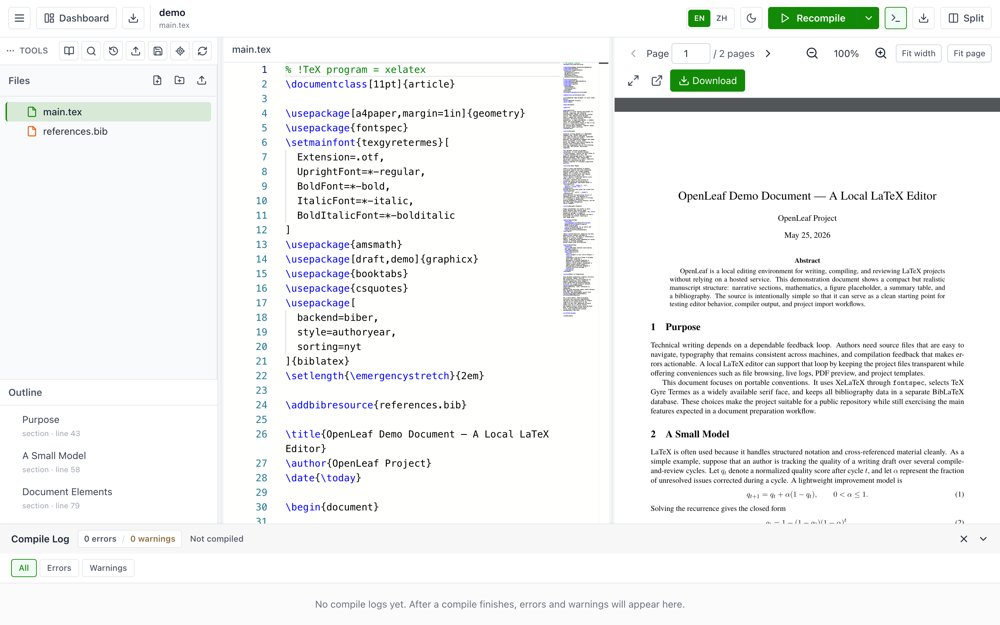
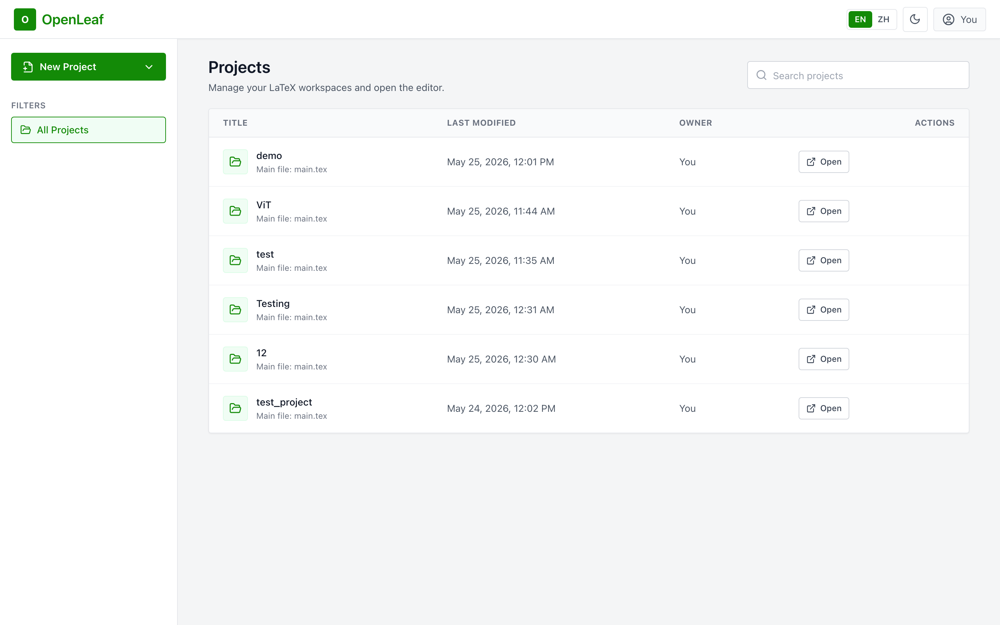

# OpenLeaf

A self-hosted, lightweight LaTeX editor that runs locally in your browser — a simpler, offline-capable alternative to Overleaf, built for personal use.




## Why OpenLeaf?

- **Local & private** — your papers never leave your machine. No account, no cloud, works offline.
- **One command, one URL** — `./run.sh` starts everything and opens your browser. No Docker, no juggling terminals.
- **Made for real writing** — XeLaTeX/PDFLaTeX with `latexmk`, BibLaTeX/biber, CJK support, SyncTeX jump between source and PDF, inline compile errors, history snapshots, project templates.
- **Your files stay files** — every project is a plain folder on disk. Open it in Finder, back it up, sync it, zip it.

## Quick Start

**1. Install a TeX distribution** (once — this is what actually compiles LaTeX):

```bash
# Option A — small (~90 MB base + a few packages), recommended to start
brew install --cask basictex
sudo tlmgr update --self
sudo tlmgr install latexmk biber biblatex csquotes tex-gyre xecjk booktabs enumitem beamer

# Option B — everything (several GB), zero package worries later
brew install --cask mactex
```

On Linux: `sudo apt install texlive-full latexmk` (or a smaller `texlive` set plus the packages above).

**2. Get OpenLeaf** (needs Python 3.11+ and Node.js 18+; the first run builds the frontend for you):

```bash
git clone https://github.com/livejiaquan/openleaf.git
cd openleaf
```

**3. Run it:**

```bash
./run.sh          # or double-click OpenLeaf.command in Finder
```

Your browser opens at `http://127.0.0.1:8000`. Open the **demo** project and hit **Recompile** — you should see a PDF in about a second.

> First run takes a couple of minutes (Python packages + one-time frontend build). After that, startup is instant.

## Where are my files?

Every project is a normal folder under `projects/` inside the OpenLeaf directory. Prefer somewhere easier to find and back up? Point OpenLeaf at any folder:

```dotenv
# .env
OPENLEAF_PROJECTS_DIR=~/Documents/OpenLeaf
```

## Screenshots

| Dashboard | Editor |
| --- | --- |
|  |  |

## Features

- Browser-based project dashboard for creating LaTeX projects from starter templates (blank, English article with bibliography, Chinese xeCJK article, Beamer presentation, CV), importing ZIP projects, searching, renaming, copying, and deleting projects.
- Download any project as a source ZIP from the dashboard or the editor toolbar (compile artifacts and internal state excluded; figure PDFs and `.bbl` preserved).
- Monaco editor integration with LaTeX syntax highlighting, snippets, line numbers, minimap, word wrap, and context-aware auto-complete: citations/labels, a LaTeX command dictionary, environment names after `\begin{`, and project file paths inside `\input`, `\include`, `\includegraphics`, `\bibliography`, and `\addbibresource`.
- Inline compile errors and warnings as squiggles in the source, plus a compile log panel with clickable source locations.
- Live PDF preview powered by `react-pdf`, with page navigation, fit-to-width, fit-to-page, zoom controls, Ctrl+Scroll zoom, fullscreen mode, open-in-new-tab, and PDF download.
- SyncTeX support for source-to-PDF and PDF-to-source navigation.
- File tree management for creating, renaming, deleting, uploading, and downloading files and folders.
- XeLaTeX as the default compiler and PDFLaTeX as an alternate, using `latexmk` when available and falling back to the selected engine directly.
- Draft mode, stop-on-first-error mode, auxiliary-file cleanup, compile time reporting, and per-project compile locking.
- Auto-save with optional debounced auto-compile, unsaved-changes protection on navigation and tab close.
- Project history snapshots: automatic snapshots before save/upload/delete/restore, manual checkpoints, one-click restore.
- Project-wide text search and a citation/label panel for browsing, inserting, and jumping to BibTeX keys and LaTeX labels.
- Dark and light themes, English/Chinese interface, per-project PDF view memory.

## Configuration

All settings are optional — copy `.env.example` to `.env` to customize.

| Variable | Default | Description |
| --- | --- | --- |
| `BACKEND_HOST` | `127.0.0.1` | Bind address. Localhost-only by default (single-user, privacy-first). Set `0.0.0.0` only if you intentionally want LAN access — the API has no authentication. |
| `BACKEND_PORT` | `8000` | Backend port. In dev mode, `frontend/vite.config.ts` proxies to port `8000`. |
| `OPENLEAF_PROJECTS_DIR` | `<repo>/projects` | Where your LaTeX projects are stored. Set to e.g. `~/Documents/OpenLeaf` to keep papers somewhere easy to find. |
| `ALLOWED_ORIGINS` | local Vite origins | Comma-separated origins allowed by CORS and the compile WebSocket. Only relevant in dev mode. |

## Supported Compilers

| Compiler | Status | Notes |
| --- | --- | --- |
| XeLaTeX | Default | Recommended for Unicode and CJK documents. |
| PDFLaTeX | Supported | Useful for many English-only or legacy LaTeX documents. |

Compilation uses `latexmk` when available (with automatic recovery from a poisoned cache). If `latexmk` is not installed, OpenLeaf falls back to the selected engine directly.

## Security

- OpenLeaf is designed for local, single-user use. It does not provide multi-user authentication or a hardened public-hosting sandbox.
- The backend binds to `127.0.0.1` by default, so it is not reachable from other machines. Opt in to LAN access with `BACKEND_HOST=0.0.0.0` only on networks you trust.
- Project IDs, file paths, main document paths, ZIP import contents (with size limits), and uploaded file extensions are validated to prevent path traversal and unsafe writes; internal state (history snapshots) is not reachable through the file APIs.
- The compile WebSocket validates the browser `Origin`, and compile timeouts kill the whole process group.
- LaTeX compilation runs your local TeX toolchain against project files — do not compile untrusted projects on a sensitive machine.

## Development

```bash
./start.sh                 # dev mode: backend :8000 + Vite dev server :5173 with hot reload
```

Backend tests (from `backend/`, needs `pytest pytest-asyncio httpx`):

```bash
python -m pytest
```

Frontend checks (from `frontend/`):

```bash
npm run lint && npx tsc --noEmit
npm run test:completions && npm run test:pdf-sync && npm run test:markers && npm run test:i18n && npm run test:routes
npm run build              # production bundle served by the backend
```

Architecture notes live in `docs/DEVELOPMENT.md`; CJK font setup in `docs/CJK_FONT_GUIDE.md`.

## Contributing

Contributions are welcome!

1. Fork the repository and create a focused branch.
2. Make your changes with tests where practical.
3. Run the backend and frontend checks above.
4. Open a pull request with a clear description and verification notes.

## License

[MIT](LICENSE)
